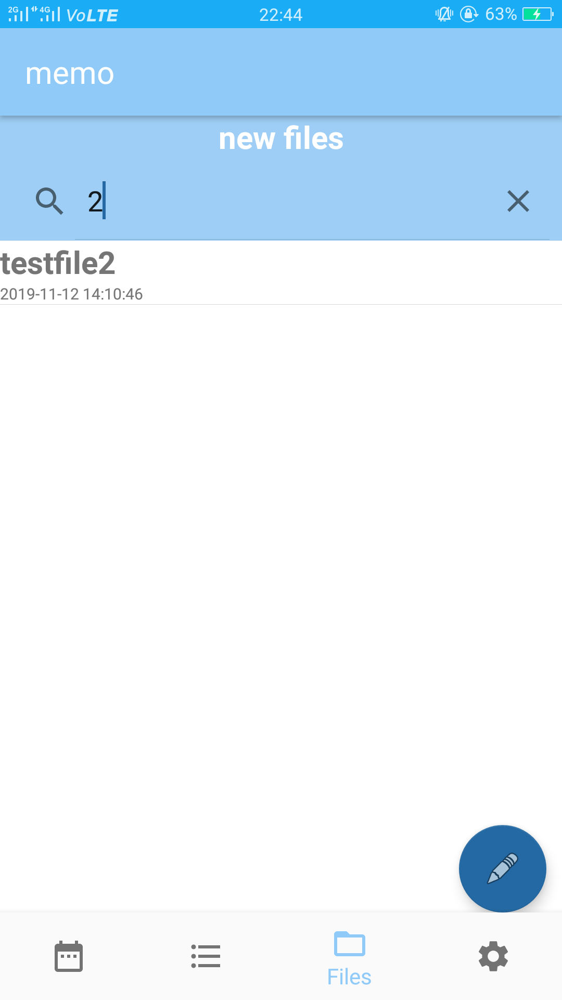
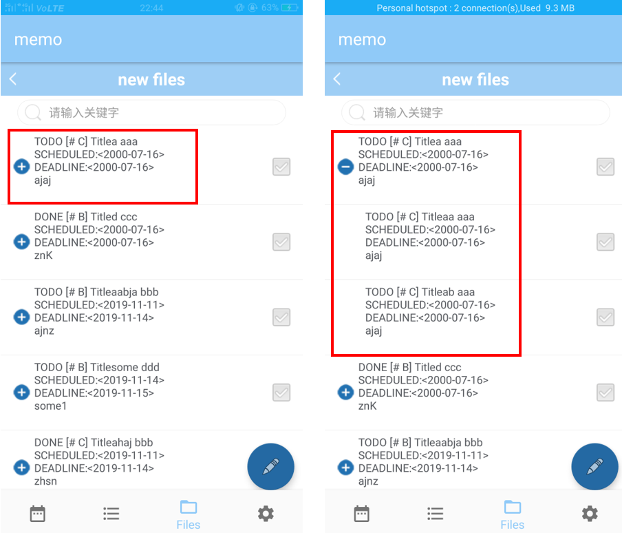

# Android 系统下的文本笔记类 APP

**Date : 2019-11-12**

> 课程名称：智能终端软件开发技术
>
> APP名称：memo
>
> 专业：信息安全
>
> 组长：刘非凡    STUDENT ID：3170102894
>
> 组员：章雨婷    STUDENT ID：3170102582
>
> 电子邮件地址：3170102894@zju.edu.cn / 3170102582@zju.edu.cn 
>
> 手机：17326085029 / 18888922655
>
> 任课老师：张寅


# Contents #

* Outline
{:toc}


## Chapter 1 : 系统简介

设计实现一个 Android 系统下的文本笔记类 APP，要求按照 Org-mode 的方式实现纯文本任务管理。 

 APP 能够满足如下要求： 

* 定义任务（Item）和子任务，每一条 Item 包括定义任务状态、设置任务优先级、跟踪子任务完成情况、用复选框标记非标题类型的子任务等； 

* 同时能提供查询任务，根据关键字和时间戳过滤的功能； 

* 根据时间轴展示相关任务列表，提供全局任务文件清单和全局 TODO 任务列表； 


## Chapter 2 : 总体架构及功能划分

### Part 1.  总体架构


### Part 2. 功能划分

#### Part 2.1  新建ITEM

新建ITEM调用右下角fab打开EDIT ITEM页面并写入文件名和存储路径名：


选择状态和优先级：


可以对TAG进行查询，还可添加TAG并显示：


时间戳进行滚动选择，可以通过按键进行日期的快速跳转：


可以通过下面按键实现加1天，加7天，减一天，减七天操作：


Notes写入的同时可以通过点击Notes按键对写入Notes的内容进行显示以方便检查：


通过修改路径名还可创建子文件，如图红色框出页面：


最后在files中检测文件是否成功存入，如图红色框出发现文件已经成功存入：


#### Part 2.2  时间轴文件清单格式

时间轴文件通过获取手机系统时间判断当前日期，并显示此日期前一天和后五天涵盖一周范围内的文件内容：


#### Part 2.3  TODO 文件清单格式

TODO文件从所有文件夹中提取TODO状态的文件，同时按照文件进行 分类，并统计每个文件中有多少个TODOtasks，每个item显示了文件的标题以及DEADLINE：


#### Part 2.4  全局文件清单格式

全局文件可以显示已创建的所有文件及其最后修改时间：


可对文件名进行搜索过滤：



点进文件会显示其中的所有item，如果想要查看二级item可以点击一级item左边的expand符号进行展示：



同时可以搜索item中包含的关键字内容并进行标红显示：


#### Part 2.5  搜索过滤功能

搜索过滤功能仅限于TAGS的搜索过滤以及文件中，文件夹名称搜索过滤和item内容搜索过滤

* TAGS搜索

  

* 文件夹名称搜索过滤

  

* item内容搜索过滤

  

#### Part 2.6  多级子目录功能

多级子目录通过点进文件会显示其中的所有item，如果想要查看二级item可以点击一级item左边的expand符号进行展示：


#### Part 2.7  文件存储格式

为了方便手机查询org-mode文件，将文件名后缀定义为.txt方便手机查看文件，文件在手机上存储的具体格式如下：


## Chapter 3 : 关键数据结构/算法

### Part 3.1 Fragment结构

采用Fragment主要还是为了配合下面导航栏的切换，根据导航的按钮切换到不同的Fragmen以实现导航的效果。此处采用监听导航栏按钮从而跳转Fragment来实现。（此处根据需求，定义了五个Fragment）

此处是定义的Fragment:


跳转Fragment实现：

```java
getSupportFragmentManager()
    .beginTransaction()
    .replace(R.id.frameLayout, new XXXFragment(), null) 
    //XXXFragment是我要跳转的Fragment类
    .addToBackStack(null)
    .commit();
```

主页面采用的是Agenda的fragment，它将在主函数的onCreate()开始部分被设置。


### Part 3.2 Agenda日程结构

#### 3.2.1 Agenda日程界面要求

Agenda以时间轴列表按照时间顺序展示当天的任务以及日期前一天至日期后六天的总共一周时间的任务。

其中已完成、时间超过、未完成的不同任务在右边侧栏显示，每条 Item 展示图中所示相关信息包括文件名以及Item标题名。


#### 3.2.2 Agenda日程界面结构

​	由于日程日期和文件信息需要后端传入，且数量不定，所以标题栏和文件信息内容栏都需要使用Listview的xml文件格式，这里使用了嵌套Listview的格式来对Agenda日程文件进行显示。

​	嵌套Listview使用两个自定义适配器来对每个Item进行显示：

嵌套Listview的xml设计如下：

第一层xml：

```xml
<?xml version="1.0" encoding="utf-8"?>
<LinearLayout ...>

    <SearchView
        ... />

    <ListView
        android:id="@+id/list_agenda"
        android:layout_width="match_parent"
        android:divider="@null"
        android:clickable="false"
        android:listSelector="@android:color/transparent"
        android:dividerHeight="0dp"
        android:layout_height="wrap_content" />

</LinearLayout>
```

其结构显示如图：


第二层xml：

```xml
<?xml version="1.0" encoding="utf-8"?>
<LinearLayout ...>

    <TextView
        ... />

    <TextView
        ... />

    <ListView
        android:id="@+id/list_agenda_time"
        android:layout_width="match_parent"
        android:divider="@null"
        android:clickable="false"
        android:listSelector="@android:color/transparent"
        android:dividerHeight="0dp"
        android:layout_height="wrap_content" />

</LinearLayout>
```

其结构显示及子类定义如图：


后端对子Listview的定义：

其中第一层Listview包含第二层Listview的相应实体文件

```java
public class FirstEntity {
    String userName;
    List<SecondEntity> secondList;
    
    public String getUserName() {
        return userName;
    }
    public void setUserName(String userName) {
        this.userName = userName;
    }
    public List<SecondEntity> getSecondList() {
        return secondList;
    }
    public void setSecondList(List<SecondEntity> secondList) {
        this.secondList = secondList;
    }
}
```
第二层实体文件包含需要显示的三个Item信息
```java
public class SecondEntity {
    String param1;
    String param2;
    String param3;

    public String getParam1() {
        return param1;
    }
    public void setParam1(String param1) {
        this.param1 = param1;
    }
    public String getParam2() {
        return param2;
    }
    public void setParam2(String param2) {
        this.param2 = param2;
    }
    public String getParam3() {
        return param3;
    }
    public void setParam3(String param3) {
        this.param3 = param3;
    }
}
```

文件嵌套结构如下：


### Part 3.3 TODO结构
### 3.3.1 TODO日程界面要求

TODO 列表要求标出所有文件中 TODO 状态的任务，每条 Item 展示的信息如图，包括Item的截止日期以及其Title名称，状态为TODO，且要求按文件进行分层并标出每个文件中有多少个TODO文件（tasks）。 


### 3.3.2 TODO日程界面结构

​	TODO日程界面与Agenda类似，也运用了嵌套Listview结构类型，与Agenda共用同样的适配器和实体结构，具体解释在Agenda日程界面结构中给出，此处不加赘述。

### Part 3.4 File结构

#### Part 3.3.1 Files界面要求 

​	每一次操作的开始，都需要选择或创建一个文件来存储任务日志 Item 的数据，这样做 的原因主要是方便通过文件级别来对所有任务进行管理，方便文件数据的同步，例如运用云存储的方式进行不同移动端的数据管理。 

​	**文件布局要求**：实验要求能够创建多个文件，通过对不同文件数据的读取，来整合每个文件对应时间所有的任务日志，对不同任务文件进行管理。


​	**单个文件内的格式要求**：全局文件清单的 Item 属性顺序必须按照状态、优先级、标题、标签、时间戳、内容的 顺序进行展示，若是 TODO 状态，则需要用不同颜色进行提示，在完成后自动添加 CLOSED 项标注完成的时间戳。（时间戳格式如上，可查询标准时间戳格式）


#### Part 3.3.2 Files界面结构

​	Files由于需要跳转因此需要定义两个Fragment, 主Fragment用来显示文件列表，此处采用ListView, 次Fragment用于显示Item的多级子任务列表。此处结合了ListView，实现了多级树的结构，并一级任务依靠展开来显示子任务。本实验只实现了两级的子目录。

​	主Fragment XML结构显示如图：此处自定义了Item用于显示政府标题


​	次Fragment结构类似，但是并没有自定义List的Item，此处就不展示了。

​	为了显示出多级子任务的效果，我们组的实验选择了展开而不是缩进，以实现一种树形的结构。我们自定义了树节点类，用于存放节点的id信息和父节点的id信息，以便于在读文件后，找到属于某个一级目录的所有子目录，对页面进行分层布局。

​	TreePoint的定义：

```java
public class TreePoint {
    private String ID;        // 7241,     //账号id
    private String NNAME; // "节点内容",    //内容
    private String PARENTID;   // 0,       //父id     0表示父节点
    private String ISLEAF;     //0,        //是否是叶子节点   1为叶子节点
    private int DISPLAY_ORDER; // 1        //同一个级别的显示顺序
    private int ChildNUM; //子节点数量
    private boolean isExpand = false;  	   //是否展开了
    private boolean isSelected = false;    //是否选中了
}
```

### Part 3.5 EDIT ITEM结构

EDIT ITEM包含了标题栏、文件存储路径、状态、优先级、标签以及日期设置和Note设置。


* 标题和存储路径

  标题项和文件存储路径要求为必填，任务日志数据以文本文件的形式进行存储，每一个文件都可以包含多个 Item，因此文件名属性为必填项，需要指定相应的文件来存储 Item 信息，具体的文件要求在后面提供。

  设置某一状态为必读项目（即如果为空则进行提示并结束保存任务）：

  ```java
  if (TextUtils.isEmpty(content_title)) {
  Toast.makeText(edit_item.this, 
    "No content to add to Title", Toast.LENGTH_SHORT).show();
    return;
  }
  ```

* 状态选项

  其中状态选项分为 TODO 和 DONE 以及默认 None 三种，通过控件进行选择。

  状态选项调用了Dialog进行弹窗显示并选择，同时修改按钮选择结果所对应的Textview对话框：

  ```java
  final AlertDialog.Builder builder = new AlertDialog.Builder(edit_item.this);
  	builder.setTitle("Set State"); //设置对话框的标题
  	builder.setSingleChoiceItems(items, 0, new DialogInterface.OnClickListener() {
  		@Override
  		public void onClick(DialogInterface dialog, int which) {
  		Toast.makeText(edit_item.this,
  		"You selected " + items[which], Toast.LENGTH_SHORT).show(); //显示选择结果
  		TextView textView = findViewById(R.id.text_state);
  		textView.setText(items[which]);
  		content.setstate(items[which]);
  		}
  	});
  setPositiveButton(builder);//添加“确定”按钮
  setNegativeButton(builder);//添加“取消”按钮
  builder.create().show(); // 创建对话框并显示
  ```

  状态栏弹窗：

  

* 优先级选项

  优先级分为 A、B、C、D 以及默认 None 五种，同样通过控件进行选择。

  优先级弹窗：

  

* 标签选项

  标签可自由创建，基础要求为每次通过文本输入来定义标签。通过点击标签按钮实现标签的选择，同时也可以使用搜索界面来对已有标签进行搜索。结合Searchview控件和Listview控件嵌套使用来实现tags的搜索功能。

  Searchview控件和Listview控件结合并调用Java自带适配器进行搜索：

  ```java
  final ArrayAdapter adapter = new ArrayAdapter(edit_item.this, android.R.layout.select_dialog_item, words);
  mListView.setAdapter(adapter);
  //true表示listview获得当前焦点的时候，与相应用户输入的匹配符进行比对，筛选出匹配的ListView的列表中的项
  mListView.setTextFilterEnabled(true);
  mListView.setOnItemClickListener(new AdapterView.OnItemClickListener() {
  	@Override
  	public void onItemClick(AdapterView<?> parent, View view, int position, long id) {
  		String item = (String) adapter.getItem(position);
  		TextView textView = findViewById(R.id.text_tags);
  		textView.setText(item);
  		content.setTags(item);
  		dialog.dismiss();
  	}
  });
  searchView.setOnQueryTextListener(new SearchView.OnQueryTextListener() {
  	// 当点击搜索按钮时触发该方法
  	@Override
  	public boolean onQueryTextSubmit(String query) {
  		return false;
  	}
  
  	// 当搜索内容改变时触发该方法
  	@Override
  	public boolean onQueryTextChange(String newText) {
  		if (!TextUtils.isEmpty(newText)) {
  		//使用此方法搜索会出现一个黑色框框
  		//未显示效果采用下面方法 不会出现黑色框
  		adapter.getFilter().filter(newText);
  		} 
          else {
  		adapter.getFilter().filter("");
  		}
  	return false;
  	}
  });
  ```

  标签选择搜索栏：

  

  同时，添加tags的同时写入文件，文件命名TAGS用来存储已经使用过的TAGS以方便搜索及下次调用。

  增加标签：

  

* 时间戳选项

  自定义对话框弹窗，可以滚动日期选择时间，也可以通过按钮对时间进行操作，操作后的时间会显示在界面上，对应的星期信息将显示在对话框的标题栏，选择完日期按下确定后，可以将时间戳显示在属性界面上。


* Notes添加

  Notes添加页面，从文本框中输入内容。

  

  同时可以通过点击NOTES按钮显示已输入的Notes：

  


### Part 3.6 FILE IO设计（Org-mode）

​	后台数据存储要求不同文件用文本形式按照 Org-mode 的模式进行存储，多级任务 Item 存储形式如下（每个新的 Item 都以 * 号开头，下一级子目录比上一级多一个 * 号）

​	文件读取时为一串字符串，需对文件内容进行拆分，同时，文件内容有不确定数目的Item及其子Item，所以为了数据获取的便捷性，定义了三个Class用来存储一个文件的具体内容：

* 一级文件

  一级文件包含filename文件名，num_main_item表示一共有多少个一级item，items用于存储一级item及其子items。

	```java
	public class Files_content {
    	public String filename;
    	public int num_main_item;
    	public File_item[] items;

    	public Files_content()
    	{
        	this.filename = "";
        	this.items = new File_item[100];
        	this.num_main_item = 0;
    	}
	}
	```

* 一级Item

  一级Item包含has_child_file即是否有子Item，this_item表示一级item具体内容，num_child_item表示有多少个子Item，child_items表示每个子Item的具体内容。

  ```java
  public class File_item {
      public boolean has_child_file;
      public Content this_item;
      public int num_child_item;
      public Content[] child_items;
  
      public File_item()
      {
          this.has_child_file = false;
          this.this_item = new Content();
          this.child_items = new Content[100];
          this.num_child_item = 0;
      }
  }
  ```

* 二级Item即Item具体内容

  二级Item包含item创建时的所有信息。

  ```java
  public class Content {
      public String level;
      public String state;
      public String Priority;
      public String Headline;
      public String Tags;
      public String scheduledTime;
      public String deadline;
      public String showonTime;
      public String Note;
  
      public Content()
      {
          this.level = "";
          this.state = "None";
          this.Priority = "None";
          this.Headline = "";
          this.Tags = "None";
          this.scheduledTime = "";
          this.deadline = "";
          this.showonTime = "";
          this.Note = "";
      };
  }
  ```

文件读取与存储都在sdcard上进行，所以需要在manifest.xml文件中添加写入和读取许可：

```xml
<!-- SDCard中创建与删除文件权限 -->
<uses-permission android:name="android.permission.MOUNT_UNMOUNT_FILESYSTEMS"/>

<!--读取SDCard数据权限-->
<uses-permission android:name="android.permission.READ_EXTERNAL_STORAGE"/>

<!-- 向SDCard写入数据权限 -->
<uses-permission android:name="android.permission.WRITE_EXTERNAL_STORAGE"/>
```

同时为了方便使用，将写入文件和从文件读取写成函数，以方便后续调用，其中，读取函数返回之前定义的结构体，包含了所有文件：

```java
public Files_content ReadFromFile(String filename) {...}
public void WriteToFile(Files_content one_file) {...}
 public static void writeExternal(Context context, String filename, String content) throws IOException {...}
public static String readExternal(Context context, String filename) 
throws IOException {}
```

为了方便手机查询org-mode文件，将文件名后缀定义为.txt方便手机查看文件，文件在手机上存储的具体格式如下：


## Chapter 4 : 开发困难及解决方案

### 4.1 困难1

* 困难

  首先，原本想在TAGS的选择和过滤以及添加在Dialog中实现Searchview和Recyclerview的嵌套，但是在Dialog中难以实现Recyclerview的搜索过滤，因为其适配器需要自己定义

* 解决方案

  进行Searchview和Listview的嵌套实现，可以使用Listview自带适配器搜索过滤

### 4.2 困难2

* 困难

  Fragment和Acitivity之间的传参，Fragmment之间的传参问题

* 解决方案

  定义了全局变量位于Application类中

### 4.3 困难3

* 困难

  alendar上星期的显示，一开始直接从最后Get选定的年月日来确定星期，但是一直不管用

* 解决方案

  最后在每个改变日期的Button的监听器中去获取星期来显示

### 4.4 困难4

* 困难

  实现多级子任务，从文件读取item后很难匹配到父任务

* 解决方案

  最后定义了全局的内容分割的类来实现


## Chapter 5 : 小组分工

刘非凡：Fragment结构，全局文件清单，多级子目录功能，搜索过滤功能，时间戳

章雨婷：Agenda日程结构，TODO结构，文件存储格式，Item 任务格式


## Chapter 6 : 总结

未实现的功能还有很多，例如：

* Settings主题颜色切换，困难点，更改布局（settheme(new_style)）后，recreate()难以执行，可能是由于Fragment被重复新建导致，目前未解决此问题。 
* 在时间选择器上，根据月份对应天数功能未实现，由于套用了一个滚动选择器的模板，采用年月日数组列表的增删对应到显示年月日，很难在循环内根据月修改日对应的数组列表。
* 提醒功能，套用网上定义的的系统时间Utils类，报错，很难执行，便未实现此功能

总体基础功能基本上实现了，界面美观大方，UI交互非常边界流畅，加载速度较快，总体来说实现的APP功能比较完善，也学到了很多知识，收获颇丰。
